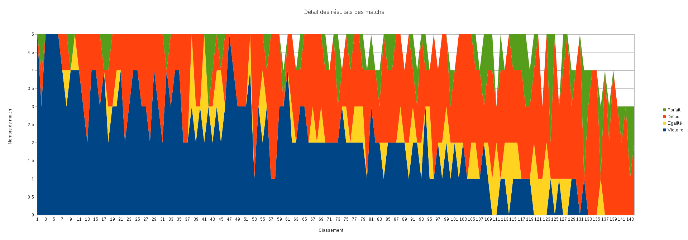

# Quelques statistiques sur la coupe 2012

Mon esprit analytique prenant souvent le dessus, je me suis amusé à triturer les résultats présents sur le site d'Eurobot : [http://www.planete-sciences.org/robot/live/coupe2012/series/classement-apres-le-tour-5/](http://www.planete-sciences.org/robot/live/coupe2012/series/classement-apres-le-tour-5/ "")

Les résultats que j'ai utilisés sont ceux des phases de qualifications (donc des 5 matchs), et qui permettent l'accès aux phases finales.

Ces données permettent de situer quel était le niveau requis pour un robot pour accéder aux finales, mais donnent aussi des idées sur l'écart entre équipes, ainsi que la part entre les points marqués et les points de victoire.

Et maintenant présentation en image de ces résultats !
','
# Statistiques complètes
## Classement par points

Pour commencer, le plus intéressant est bien sur de regarder le nombre de points totaux des équipes, sachant que le classement est basé dessus.

Le plus impressionnant dans cette courbe est bien sur la différence de points entre RCVA (1er) et ClubElek (2e) : 103 points d'écart pour un total de 263 points pour RCVA ! Ils ont ainsi 65% de points de plus que le second !

Après cela, on observe un écart assez important entre les 16 premiers (jusqu'à 10 points). Le 16e a ainsi 52 points de moins que le 2nd (108 vs 160).

Puis les écarts entre les suivants sont moins sensibles (entre 0 et 2 points) jusqu'à la fin du classement.
## Proportion points marqués et points de victoire

Le total de point est la somme des points marqués par le robot en réalisant des actions de jeux, et les points de victoire :

* 10 points pour une victoire
* 5 points pour une égalité
* 2 points pour une défaire
* 0 points pour un forfait

La courbe suivante montre la part des points marqués sur le total.

On peut remarquer que les points de victoire compte pour une part importante dans les résultats de cette année. Le classement n'en est pas énormément modifié, car généralement les robot marquant le plus de points sont aussi ceux qui remportent les match et donc les points de victoire. Cependant, le classement est quand même modifié par ces points, et de nombreux robots sont à une position qui ne reflète pas exactement le nombre de points marqués.

Une autre façon de voir ce résultat est de tracer le pourcentage de points marqués par rapport au points totaux.

Le pourcentage est assez variable. Cependant, on observe une tendance allant de 70% de points marqués (+/-10%) pour les meilleurs équipes jusqu'à 40% (+/-20%) pour la fin du classement. Pris à l'envers, ça veut dire que les dernières équipes doivent pour certaines plus de 70% de leurs points aux points de victoires et pas aux actions de jeu réalisé par le robot.

Ce pourcentage est moins poussé pour les meilleurs équipes, car par définition elles accumulent beaucoup plus de points pendant le match, alors que les points de victoire ne sont pas différents quelque soit le nombre de points marqués durant le match.

Une autre chose que l'on peut voir, c'est que pour des équipes proches au classement général, il peut y avoir de forts écart au niveau des points de victoire. Sachant que la différence entre une victoire et une défaite est de 8 points, il est normal que sur un total de moins de 100 points pour d'équipes cela apparaisse fortement.
## Moyenne de points marqués par match

Pour faciliter l’interprétation des résultats, voici maintenant les moyennes de résultats par match.

Les mini et maxi sont aussi présentés.

On remarque qu'environ la moitié des équipes ont atteints au moins une fois les 15 points marqués lors de l'un des match. Très peu par contre arrivent à passer les 25 points.

Le record revient là encore à RCVA qui à réalisé l'exploit de marquer 50 points lors de son 4e match ! Il ne devait pas rester grand chose sur la table... ClubElek les suivent avec 42 points lors de leur 4e match.

Si l'on regarde maintenant les moyennes, on voit que RCVA et ClubElek sont devant avec respectivement 43 et 26 points par match. Suit un groupe de 6 équipes entre 19 et 21 points par match. Puis les moyennes descendent lentement pour atteindre un "point d'entrée" pour les phases finales à environ 15 points par match.

Si l'on regarde les résultats moyen de l'ensemble des équipes pour les différents matchs on obtient :
* Tour 1 : 5.5
* Tour 2 : 6.9
* Tour 3 : 8.5
* Tour 4 : 10.0
* Tour 5 : 9.2

J'ai ici pris en compte les équipes qui n'étaient pas homologués pour les premiers matchs (avec 0 points marqués pour eux).

Cela explique en partie le fait que la moyenne des deux premiers match est assez basse : toutes les équipes n'ayant pas participé. En revanche on observe quand même une tendance à l’amélioration des résultats jusqu'au 4e match qui ne peux être expliqué seulement par cette raison.

La performance des robots augmente donc au fur et à mesure des matchs. Connaissant le travail fourni pendant la coupe, cela n'est pas étonnant. L'homologation est souvent faite avec un robot qui n'as pas encore toutes ses facultés (algos non prêts, mécanique mal réglée, électronique défaillante), qui lui sont ajoutés au fur et à mesure du temps disponible.

Si on trie les résultats des matchs par le nombre de points marqués (donc __sans faire attention à quelle équipe c'est__, afin d'avoir des courbes comparables), on obtient la courbe suivante:

Ici la progression parait plus visible. Le plat à la fin à 0 points marqués se réduit au fur et à mesure des matchs, c'est le point cité précédemment : de plus en plus d'équipes sont homologuées et marquent des points.

Par contre, on voit aussi que la courbe, sur tout sa longueur va vers le haut, ce qui démontre que les robots marquent de plus en plus.

Si on se concentre sur les 30 meilleurs résultats de chaque tour, on voit qu'il y a un gap d'environ 5 points entre le 2 et le 3e tour, alors que les deux premiers matchs étaient sensiblement proche, ainsi que les 3 derniers.

Par contre, à partir du 30ème meilleur résultat du tour, le gap se produit dès le deuxième match, puis dans une certaine mesure aussi entre le 2e et le 3e tour.

Enfin, pour tout le monde, le 5ème a tendance à être plus bas en points que le 4ème. Est ce du à l'usure des robots ? Au fait que plus de robots étaient fonctionnels, donc plus de blocage entre robots ou de points déjà pris par l'adversaire faisant perdre du temps ?
## Matchs joués et détail des résultats

On voit ici que réussir à homologuer rapidement son robot est un passage obligé pour espérer un bon classement. Les 60 premières équipes ont pu faire leurs 5 matchs.

Il semble que personne ne se soit homologué pour seulement 2 matchs, tous en ont fait au minimum 3.
## Détail des résultats des matchs

Le graphe suivant montre la proportion de victoire, égalité, défaite et forfait pour l'ensemble des équipes.

On voit qu'il n'est pas nécessaire de gagner tous ses matchs pour être en phases finales, loin de là.

5 des finalistes ont remportés tous leurs matchs. Une seule autre équipe l'a fait aussi, et a été classée 46e (Walking machines ETS Canada), ce n'est donc pas une condition suffisante non plus.

La plupart des finalistes sont donc entre 3 et 4 matchs gagnés, avec parfois une égalité

L'autre extrême est Reims2 avec ses "seulement" 2 matchs gagnés, qui parvient à la 13e place grâce à un nombre important de points marqués.

De même ClubElek a montré que même après un forfait il était possible d'être finaliste.
# Zoom sur les 16 premiers
## Points totaux et marqués

## Moyenne de points par match

On voit ici le grand écart des phases finales : la moyenne va de 42 points par match à 14...

Beaucoup sont proches des 20 points par match de moyenne, avec ClubElek devant avec ses 25 points de moyenne (malgré un forfait et une défaite !) et RCVA avec 42 points.

On voit donc ici qu'il "suffisait" de réaliser 15 points par match de moyenne cette année pour être finaliste. On voit en regardant les maxi quelques courbes au dessus, que c'est un score qu'environ la moitié des équipes à réalisé lors de l'un de ses match.

Seuls 5 des finalistes ont eux des matchs où il n'ont pas marqué de points. Tous les autres ont assuré un minimum de 5 points par match, certains 10.

RCVA joue ici encore dans une autre dimension, avec un minimum de 31 points lors de son premier match, score que seulement 5 autres finalistes ont réussi à atteindre, mais lors de leur meilleur match...

Enfin, la moyenne des points par match pour les 16 premiers est de 19,6 points.
## Nombre de robots

Est il obligé d'avoir deux robots par équipe pour aller en finales ?

On constate que seulement la moitié des 16 premiers avaient 2 robots.

En revanche, les 6 premiers avait tous 2 robots.
# Allons un peu plus loin
## Régularité

Après de nombreuses participation, une chose qui revient souvent comme "règle" pour atteindre les phases finales et d'avoir un robot régulier, et pas seulement capable de marquer beaucoup de points. Je suis le premier à le penser, voyons ce qu'il en est.

Sur la courbe de résultats précédente (points par match des 16 premiers), j'ai ajouté l'écart type entre les matchs. Je l'ai aussi tracé pour l'ensemble des équipes, mais il est difficile d'en tirer quelque chose.

J'ai alors trouvé l'idée suivante : il est normale qu'une équipe qui marque beaucoup de points ait un écart type plus important qu'une équipe qui en marque peu. En effet à une moyenne de 20 points par matchs, un écart de +/- 5 points est plus régulier que le même écart avec une moyenne de 5 points par match.

J'ai donc décidé de normaliser l'écart type par la moyenne pour voir ce que ça donnerait:

On voit maintenant se tramer une tendance. Cependant, il est difficile d'en tirer une conclusion autre que celle que les derniers robots du classement sont moins réguliers (au sens de ce critère) que les premiers. Sachant que les derniers robots ne font en général pas tous les matchs, et ont souvent des soucis les empêchant de réaliser un gros score, cette tendance reste correcte.

En revanche, il n'y a pas vraiment de lien entre la régularité (toujours au sens de ce critère) et le fait de terminer dans les 16 finaliste. Il y a même un contre-exemple avec ClubElek, le second, qui a alterné des matchs à 0 et 10 points (débuts difficiles) puis des matchs à 36, 42 et 40 points (qui sont parmi les quelques plus hauts scores réalisés).

Ce que l'on peut dire en revanche, c'est qu'un robot régulier à besoin de marquer moins de points à chaque matchs pour pouvoir atteindre les phases finales. Dis autrement, si l'on ne fait pas de mauvais scores, il n'est pas nécessaire de faire des scores énormes pour les compenser aux matchs suivants (comme ce qu'à réussi à faire ClubElek).
## Evolution du classement

Le classement évolue t'il beaucoup au fur et à mesure des match ? La courbe suivante montre le classement suite à chaque match.

En abscisse on a le classement final des équipes. En ordonnée, le classement pour chaque match.

Le classement du 5e match est donc une droite, à ceci prêt que l'on retrouve des "plats" pour les ex-aequo.

Cette courbe peut être assez difficile à lire, car il y a beaucoup de choses affichés.

Si l'on se concentre sur les 16 premiers, on peut voir que

* 1er tour (bleu) : seul ClubElek et S.M.A.R.T. étaient classés après la 50e position.
* 2e tour (orange) : recul de ClubElek à la 97e place ! Les autres sont toujours dans les 45e premiers 
* 3e tour (jaune) : retour de tout le monde en dessous de la 35e place
* 4e tour (vert) : on a quasiment le classement final avec l'ensemble des équipes sous la 20e position. Seul S.M.A.R.T était encore 31e et parviendra à se hisser à la 16 place lors de son dernier match.

La encore difficile de tirer une tendance général avec quelques contre-exemples. Les finalistes on néanmoins (presque) jamais été classés après la 45e place. Cependant rien n'est perdu jusqu'au 3e match comme l'a montré la remontée impressionnante de ClubElek.
## Impact des points de victoire sur le classement

Les points de victoire ont paru pour beaucoup trop élevés cette année face au points marqués.

La courbe suivante montre l'impact des points de victoire sur le classement avec les points marqués seuls. Positif signifie que l'ajout des points de victoire à fait gagner des places au classement, négatif qu'il en a fait perde.

Pour bien lire ce graphe, si on prend le cas de notre équipe Alpobot (12e) on obtient : -1. Cela signifie que le classement général nous a placé 12e, et que l'on a perdu une place suite à la comptabilisation des points de victoire. La classement avec les seuls point marqués (sans points de victoire) nous aurait alors placé 11e

**Attention** : gagner des places signifie avoir un classement plus petit : 11 et plus haut que 12 dans le classement !

On voit que beaucoup d'équipes n'auraient pas bougé. Cependant pour d'autres équipes les écart peuvent être supérieur à 10 places. Les extremes étant un gain de 22 places, et dans le sens inverse une perte de 19 places.

Si on ramène ça au nombre total d'équipes (144), les écarts extrèmes sont donc de +15% et -13%.

Si on prends la valeur absolue de cet écart, qui va donc reprenter le nombre de place d'écart sans prendre en compte si elles ont été gagnées ou perdues, on trouve une moyenne de 5.3 places. Sur 144 équipes ont a donc un écart moyen de 3.6% à l'échelle du classement entre la position avec et sans points de victoires.

 

Si on regarde les finalistes, on peut donner le classement avec les seuls points marqués (sans points de victoire donc).

Malgré quelques permutations dans les places, les finalistes seraient à peu près les mêmes qu'en tenant compte des points de victoire.

On note seulement l'apparition de Sérinus à le 13e place, et APBTeam à la 15e place.  Ce sont Eirbot et INTech qui leur aurait cédé la place en reculant légèrement (respectivement 19e et 21e).

Pour finir, voici une courbe présentant le nombre de victoires en fonction du nombre du nombre de points marqués (Ce n'est pas directement le nombre de points marqués en abscisse, mais le classement de l'équipe selon ce nombre de points).

Le classement en abscisse est celui par rapport au nombre total de points marqués (toujours sans les points de victoire donc).

On voit premièrement une tendance qui est que les équipes ayant marqué plus de points ont obtenus plus de victoires que les équipes marquant moins de points. En moyenne, le fait d'ajouter les points de victoire va donc dans le même sens que les points marqués, et est donc relativement neutre sur le classement (en accentuant seulement les écarts de points entre le haut et le bas du tableau).

Cependant, pour des équipes aux résultats proches (et donc au classement proche sur cette courbe), on peut voir des écarts assez importants.

Par exemple le 34e ("Ants", 60 points marqués) a seulement une victoire, là ou le 35e ("7 Robots", 59 points marqués) en a 4. En comptant les points de victoire, c'est donc 40 points qui sont rajouté à l'équipe 7 Robots, et seulement 10 à Ants, alors qu'il n'y a qu'un point marqué d'écart. Cela explique l'écart de -19 places pour Ants, et +11 places pour 7 Robots.

De même pour les 66 et 67e (CRAP et Walking Machine ETS Canada), avec respectivement 2 et 5 victoires, pour 36 et 37 points marqués. On va donc ajouter 20 points de victoire à CRAP, et 50 à Walking Machines (pour seulement 37 marqués) résultant dans une chute de 7 places et un gain de 22 places.
